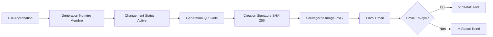
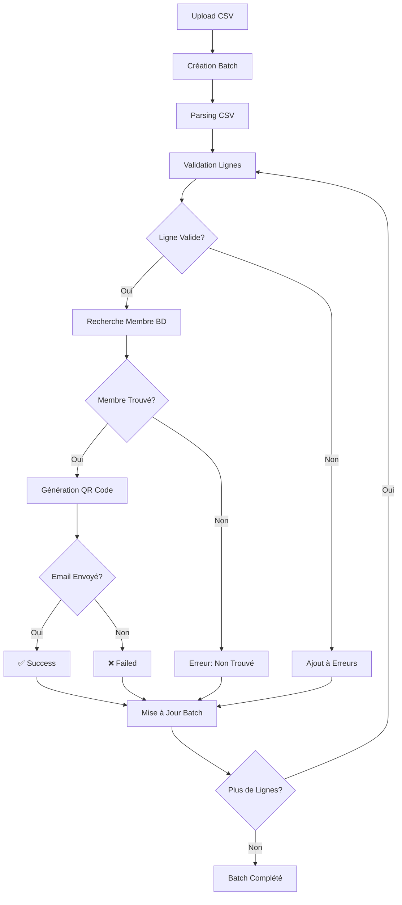

# Système de Génération et d'Envoi de QR Codes

## Vue d'ensemble

Ce système permet de générer et envoyer des QR Codes sécurisés pour les membres d'une association de deux manières :

1. **Envoi individuel** : Lors de la validation de l'adhésion d'un membre
2. **Envoi en masse** : Par importation d'un fichier CSV

## Fonctionnalités

### 1️⃣ Envoi Individuel (Membre par Membre)

#### Déclencheur
- Clic sur le bouton **"Adhésion validée"** dans l'interface admin
- Endpoint : `PUT /api/applications/:id/approve`

#### Processus Automatique



#### Données Encodées dans le QR Code

```json
{
  "memberId": "M-2025-0142",
  "name": "Jean Dupont",
  "email": "jean.dupont@email.com",
  "association": "Mizara",
  "validity": "2025",
  "status": "Membre actif",
  "signature": "a1b2c3d4e5f6789..."
}
```

#### Signature Anti-Fraude

```javascript
signature = SHA-256(memberId + secretKey + validity)
```

Exemple :
```javascript
SHA-256("M-2025-0142" + "votre-cle-secrete" + "2025")
// => "a1b2c3d4e5f6789abc123def456..."
```

#### Fichier Image Généré

- **Format** : PNG
- **Nom** : `qr_M-2025-0142.png`
- **Taille** : 400x400 pixels
- **Niveau de correction** : Haute (H)
- **Localisation** : `backend/public/qrcodes/`

#### Email Envoyé

**Objet :**
```
Votre QR Code Membre 2025 - Association Mizara
```

**Message :**
```
Bonjour Jean Dupont,

Votre adhésion est validée pour l'année 2025.
Vous trouverez ci-dessous votre QR Code personnel sécurisé.

📋 Vos informations
- Numéro de membre : M-2025-0142
- Nom complet : Jean Dupont
- Email : jean.dupont@email.com
- Association : Mizara
- Statut : Membre actif

🎫 Votre QR Code Personnel
[Image QR Code embarquée]
Valable pour l'année 2025

📱 Comment utiliser votre QR code ?
- Sauvegardez ce QR code sur votre téléphone
- Présentez-le lors de votre arrivée aux événements
- Il peut être scanné directement depuis votre écran
- Gardez une copie imprimée en cas de besoin

🔒 Sécurité
Votre QR code contient une signature numérique sécurisée (SHA-256).
```

**Pièces jointes :**
- `qr_M-2025-0142.png`

#### États Possibles

| État | Description | Emoji |
|------|-------------|-------|
| `sent` | QR Code généré et email envoyé avec succès | ✅ |
| `pending` | QR Code généré, email en cours d'envoi | ⚠ |
| `failed` | Erreur lors de l'envoi de l'email | ❌ |
| `not-generated` | QR Code pas encore généré | ⏸ |

#### Exemple de Requête

```bash
curl -X PUT http://localhost:5000/api/applications/64f1a2b3c4d5e6f7g8h9i0j1/approve \
  -H "Authorization: Bearer <admin-token>" \
  -H "Content-Type: application/json" \
  -d '{
    "notes": "Adhésion approuvée après vérification des documents"
  }'
```

#### Réponse

```json
{
  "success": true,
  "message": "Adhésion de Jean Dupont approuvée avec succès. ✅ QR Code envoyé par email.",
  "data": {
    "member": {
      "_id": "64f1a2b3c4d5e6f7g8h9i0j1",
      "firstName": "Jean",
      "lastName": "Dupont",
      "memberNumber": "M-2025-0142",
      "status": "active",
      "qrCode": {
        "code": "a1b2c3d4e5f6789a",
        "emailStatus": "sent",
        "emailSentAt": "2025-01-20T10:30:00.000Z",
        "generatedAt": "2025-01-20T10:30:00.000Z",
        "validity": "2025"
      }
    },
    "qrCodeStatus": {
      "generated": true,
      "emailSent": true,
      "emailStatus": "sent"
    }
  }
}
```

---

### 2️⃣ Envoi Automatique en Masse par Import CSV

#### Déclencheur
- Importation d'un fichier CSV via l'interface admin
- Endpoint : `POST /api/qrcodes/import-csv`

#### Format CSV Attendu

**Colonnes requises :**
```csv
memberId,name,email,status,validity
M-2025-0142,Jean Dupont,jean.dupont@email.com,active,2025
M-2025-0143,Marie Martin,marie.martin@email.com,active,2025
M-2025-0144,Pierre Durand,pierre.durand@email.com,active,2025
```

**Colonnes :**
- `memberId` ou `memberNumber` (requis) : Numéro du membre
- `name` (optionnel) : Nom complet (pour référence)
- `email` (requis) : Email du membre
- `status` (optionnel, défaut: active) : Statut du membre
- `validity` (optionnel, défaut: année courante) : Année de validité

#### Processus d'Import



#### États du Batch

| État | Description |
|------|-------------|
| `pending` | Batch créé, en attente de traitement |
| `processing` | Traitement en cours |
| `completed` | ✅ Tous envoyés avec succès |
| `partial` | ⚠ Partiellement envoyés (certains échecs) |
| `failed` | ❌ Échec complet du traitement |

#### Exemple d'Upload CSV

```bash
curl -X POST http://localhost:5000/api/qrcodes/import-csv \
  -H "Authorization: Bearer <admin-token>" \
  -F "file=@membres.csv" \
  -F "validity=2025"
```

#### Réponse d'Import

```json
{
  "success": true,
  "message": "Import terminé: 148 envoyés, 2 échecs",
  "data": {
    "_id": "65a1b2c3d4e5f6g7h8i9j0k1",
    "batchName": "Import CSV - membres.csv",
    "batchType": "csv-import",
    "validity": "2025",
    "status": "partial",
    "totalMembers": 150,
    "processedMembers": 150,
    "successfulSends": 148,
    "failedSends": 2,
    "completionPercentage": 100,
    "successRate": 99,
    "startedAt": "2025-01-20T14:00:00.000Z",
    "completedAt": "2025-01-20T14:15:00.000Z",
    "results": [
      {
        "member": "64f1a2b3...",
        "memberNumber": "M-2025-0142",
        "name": "Jean Dupont",
        "email": "jean.dupont@email.com",
        "status": "success",
        "qrGenerated": true,
        "emailSent": true,
        "emailStatus": "sent"
      },
      {
        "memberNumber": "M-2025-0999",
        "name": "Inconnu",
        "email": "inconnu@email.com",
        "status": "failed",
        "qrGenerated": false,
        "emailSent": false,
        "error": "Membre non trouvé dans la base de données"
      }
    ]
  }
}
```

---

## Système de Reprise Automatique (Retry)

### Relancer les Échecs

Si certains emails n'ont pas été envoyés, vous pouvez relancer uniquement les échecs :

```bash
curl -X POST http://localhost:5000/api/qrcodes/batch/65a1b2c3d4e5f6g7h8i9j0k1/retry \
  -H "Authorization: Bearer <admin-token>"
```

### Réponse de Retry

```json
{
  "success": true,
  "message": "Relance terminée: 1 succès, 1 échecs",
  "data": {
    "batch": { ... },
    "retriedSuccess": 1,
    "retriedFailed": 1
  }
}
```

---

## Tableau de Bord des Envois

### Voir Tous les Batches

```bash
GET /api/qrcodes/batches?status=completed&limit=20
```

### Voir Détails d'un Batch

```bash
GET /api/qrcodes/batch/:batchId
```

### Statistiques Globales

```bash
GET /api/qrcodes/batches/stats
```

**Réponse :**
```json
{
  "success": true,
  "data": {
    "totalBatches": 25,
    "completedBatches": 20,
    "failedBatches": 1,
    "processingBatches": 0,
    "totalSends": 3850,
    "totalFails": 15,
    "totalProcessed": 3865,
    "successRate": "99.61"
  }
}
```

---

## Règles Générales du Système

### Sécurité

✅ **Signature SHA-256** obligatoire sur chaque QR Code
✅ **Clé secrète** stockée dans variables d'environnement
✅ **Aucune falsification possible** grâce à la signature
✅ **Validité annuelle** : QR Code valable uniquement pour l'année paramétrée

### Format d'Image

✅ **Format PNG** obligatoire
✅ **Taille** : 400x400 pixels
✅ **Niveau de correction d'erreur** : Haute (H)
✅ **Nom de fichier** : `qr_<memberNumber>.png`

### Email

✅ **Template personnalisé** avec informations du membre
✅ **QR Code embarqué** dans le corps de l'email
✅ **Pièce jointe PNG** pour sauvegarde
✅ **Tracking du statut** d'envoi (sent/pending/failed)

### Journalisation

✅ **Historisation** de tous les envois
✅ **Tracking individuel** par membre
✅ **Tracking par batch** pour imports CSV
✅ **Rapport détaillé** des succès et échecs

---

## États et Icônes

### États Individuels

| État | Icône | Description |
|------|-------|-------------|
| Envoyé | ✅ | QR Code généré et email envoyé avec succès |
| En attente | ⚠ | QR Code généré mais email en attente |
| Erreur | ❌ | Erreur lors de la génération ou l'envoi |

### États de Batch

| État | Icône | Description |
|------|-------|-------------|
| Tous envoyés | ✅ | 100% de réussite |
| En partie envoyés | ⚠ | Certains échecs, relance possible |
| Import invalide | ❌ | Fichier CSV invalide ou processus stoppé |

---

## Exemples de Scénarios

### Scénario 1 : Approbation d'un Nouveau Membre

```javascript
// Frontend - Clic sur "Approuver"
const response = await fetch(`/api/applications/${memberId}/approve`, {
  method: 'PUT',
  headers: {
    'Authorization': `Bearer ${adminToken}`,
    'Content-Type': 'application/json'
  },
  body: JSON.stringify({
    notes: 'Documents vérifiés et conformes'
  })
});

const result = await response.json();

if (result.data.qrCodeStatus.emailSent) {
  console.log('✅ QR Code envoyé avec succès');
} else {
  console.log('⚠ QR Code généré mais email non envoyé');
}
```

### Scénario 2 : Import CSV pour Renouvellement Annuel

```javascript
// Début d'année - Générer tous les nouveaux QR Codes
const formData = new FormData();
formData.append('file', csvFile);
formData.append('validity', '2026');

const response = await fetch('/api/qrcodes/import-csv', {
  method: 'POST',
  headers: {
    'Authorization': `Bearer ${adminToken}`
  },
  body: formData
});

const batch = await response.json();

console.log(`${batch.data.successfulSends} membres ont reçu leur QR Code 2026`);

if (batch.data.failedSends > 0) {
  // Relancer les échecs
  await fetch(`/api/qrcodes/batch/${batch.data._id}/retry`, {
    method: 'POST',
    headers: { 'Authorization': `Bearer ${adminToken}` }
  });
}
```

### Scénario 3 : Monitoring du Tableau de Bord

```javascript
// Afficher le tableau de bord admin
const stats = await fetch('/api/qrcodes/batches/stats', {
  headers: { 'Authorization': `Bearer ${adminToken}` }
});

const data = await stats.json();

console.log(`
  Batches totaux: ${data.data.totalBatches}
  QR Codes envoyés: ${data.data.totalSends}
  Taux de réussite: ${data.data.successRate}%
`);

// Lister les batches récents
const batches = await fetch('/api/qrcodes/batches?limit=10');
const batchList = await batches.json();

batchList.data.batches.forEach(batch => {
  console.log(`${batch.batchName}: ${batch.status} (${batch.successfulSends}/${batch.totalMembers})`);
});
```

---

## Configuration

### Variables d'Environnement

```env
# QR Code Secret Key (OBLIGATOIRE)
QR_CODE_SECRET_KEY=your_super_secret_qrcode_key_change_this_in_production

# Email Configuration
SMTP_HOST=smtp.gmail.com
SMTP_PORT=587
SMTP_USER=your-email@gmail.com
SMTP_PASSWORD=your-app-password
EMAIL_FROM=noreply@mizara.mg
```

### Création du Dossier Uploads

```bash
mkdir -p backend/uploads
mkdir -p backend/public/qrcodes
```

### Installation des Dépendances

```bash
cd backend
npm install csv-parser multer
```

---

## API Reference

### Endpoints Disponibles

| Méthode | Endpoint | Description | Accès |
|---------|----------|-------------|-------|
| PUT | `/api/applications/:id/approve` | Approuver membre et envoyer QR | Admin |
| POST | `/api/qrcodes/import-csv` | Import CSV et envoi masse | Admin |
| POST | `/api/qrcodes/batch/:id/retry` | Relancer échecs d'un batch | Admin |
| GET | `/api/qrcodes/batches` | Liste des batches | Admin |
| GET | `/api/qrcodes/batch/:id` | Détails d'un batch | Admin |
| GET | `/api/qrcodes/batches/stats` | Statistiques globales | Admin |
| POST | `/api/qrcodes/generate/:memberId` | Générer QR individuel | Admin |
| POST | `/api/qrcodes/verify` | Vérifier un QR Code | Public |

---

## Résolution de Problèmes

### QR Code non Généré

**Causes possibles :**
- Membre sans memberNumber
- Erreur dans la génération de l'image
- Problème de permissions sur le dossier `public/qrcodes/`

**Solution :**
```bash
# Vérifier les permissions
chmod 755 backend/public/qrcodes/

# Vérifier que le membre a un memberNumber
db.members.findOne({ email: "jean@email.com" })
```

### Email non Envoyé

**Causes possibles :**
- Configuration SMTP incorrecte
- Email invalide
- Limite de taux SMTP dépassée

**Solution :**
```bash
# Tester la configuration SMTP
node backend/test/testEmail.js

# Vérifier les logs
tail -f backend/logs/combined.log
```

### Import CSV Échoué

**Causes possibles :**
- Format CSV incorrect
- Colonnes manquantes
- Encodage du fichier incorrect

**Solution :**
```bash
# Vérifier l'encodage
file -i membres.csv
# Doit retourner: charset=utf-8

# Convertir si nécessaire
iconv -f ISO-8859-1 -t UTF-8 membres.csv > membres_utf8.csv
```

---

## Modèle de Données

### QRCodeBatch

```javascript
{
  _id: ObjectId,
  batchName: String,
  batchType: 'csv-import' | 'manual' | 'bulk-regenerate' | 'yearly-renewal',
  validity: String,  // "2025"
  status: 'pending' | 'processing' | 'completed' | 'failed' | 'partial',
  totalMembers: Number,
  processedMembers: Number,
  successfulSends: Number,
  failedSends: Number,
  results: [
    {
      member: ObjectId,
      memberNumber: String,
      name: String,
      email: String,
      status: 'success' | 'failed' | 'pending',
      qrGenerated: Boolean,
      emailSent: Boolean,
      emailStatus: String,
      error: String,
      processedAt: Date
    }
  ],
  csvFilename: String,
  startedAt: Date,
  completedAt: Date,
  createdBy: ObjectId,
  retryCount: Number,
  lastRetryAt: Date,
  completionPercentage: Number,  // Virtual
  successRate: Number  // Virtual
}
```

---

## Support

Pour toute question ou problème :

- **Documentation API** : `/api-docs`
- **Logs** : `backend/logs/`
- **Email de support** : contact@mizara.mg

---

© 2025 Association Mizara - Système de Génération et d'Envoi de QR Codes v2.0
